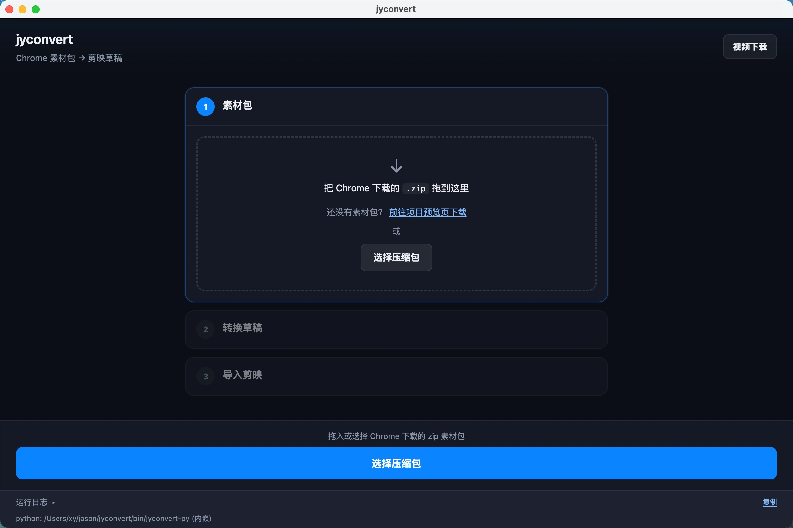
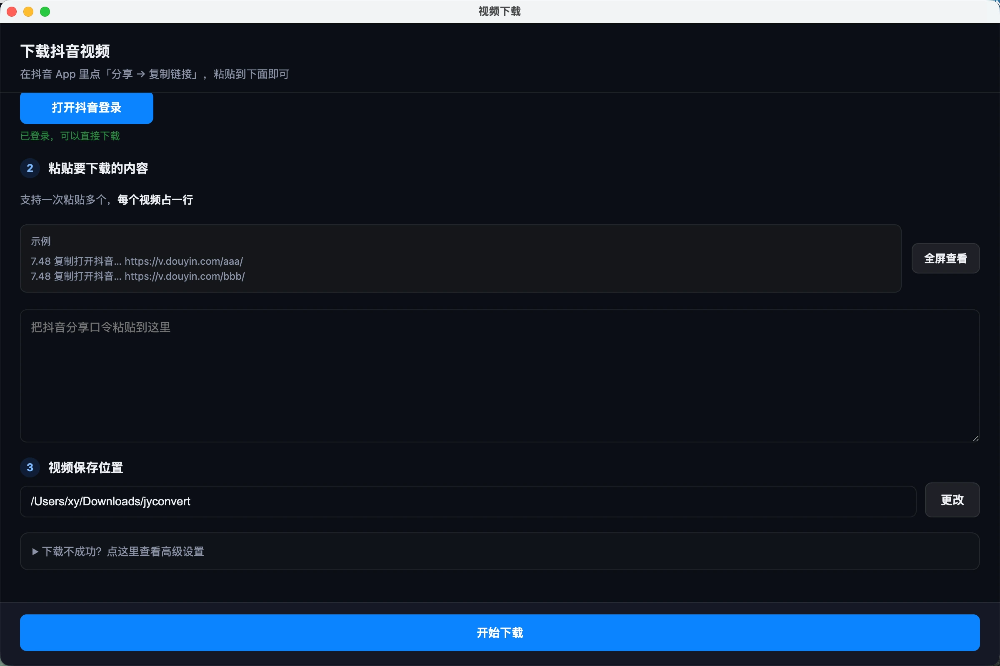

# jyconvert

桌面小工具，帮你做两件事：**把[项目预览页](https://agent.tfwang.top/#/project-preview)下载的素材包转成剪映草稿**，以便在剪映里二次编辑；以及**下载抖音视频**。下载安装包即可使用，无需自己装 Python、ffmpeg 等环境。

---

## 下载

在 GitHub Releases 页面下载对应系统的安装包：

**https://github.com/cgeffect/jyconvert/releases**

| 系统 | 下载文件 | 说明 |
|------|----------|------|
| macOS（Apple 芯片） | `jyconvert-x.y.z-arm64.dmg` | M1 / M2 / M3 等 arm64 Mac |
| Windows（64 位） | `jyconvert-x.y.z-win-x64.exe` | x64，不支持 32 位 |

> 目前 Mac 版为 **arm64**，暂不支持 Intel Mac。Mac 与 Windows 安装包不能混用。

---

## 功能一：剪映格式转换

把 [项目预览页](https://agent.tfwang.top/#/project-preview) 下载的 **素材包 `.zip`** 转成剪映 Pro 能打开的草稿，并一键导入剪映，方便在剪映里继续编辑。

### 素材从哪里来

在浏览器打开 **[https://agent.tfwang.top/#/project-preview](https://agent.tfwang.top/#/project-preview)**，进入项目预览页，下载导出的素材包（`.zip`）。

### 怎么用

1. 打开 jyconvert
2. 把从项目预览页下载的 `.zip` **拖进窗口**，或点「选择压缩包」
3. 填写**草稿名称**，点「开始转换」
4. 确认**剪映草稿目录**（Mac 一般会自动填好），点「导入剪映」
5. 打开剪映，在草稿列表里找到刚导入的项目

### 使用注意

- 需要先安装 **剪映 Pro**
- 导入成功后，可以在剪映里预览、导出，但**不要在剪映里再次保存（Cmd+S / Ctrl+S）**，否则草稿会被加密，之后难以用工具再编辑
- 若剪映列表没刷新，重启一下剪映

---

## 功能二：抖音视频下载

点击主界面右上角 **「视频下载」**，可批量下载抖音分享链接对应的视频。

### 怎么用

1. 点「打开抖音登录」，在弹出窗口里登录抖音（只需第一次）
2. 把抖音 App 里复制的**分享口令或链接**粘贴到输入框（支持多行，一行一个）
3. 选择保存目录，点「开始下载」

### 使用注意

- 第一次使用需要**登录抖音**；登录信息保存在本机，下次一般不用重复登录
- 若下载失败，可展开「高级设置」，尝试切换浏览器 Cookie 来源，或重新同步登录

---

## 系统支持与安装说明

### macOS（Apple 芯片 / arm64）

| 项目 | 说明 |
|------|------|
| 支持芯片 | Apple Silicon（M 系列），**不支持 Intel Mac** |
| 系统版本 | 建议 macOS 12 及以上 |
| 安装方式 | 打开 `.dmg`，把 jyconvert 拖进「应用程序」 |
| 首次打开被拦截 | 本应用暂未做 Apple 官方签名。请 **右键图标 → 打开**，或在「系统设置 → 隐私与安全性」里点「仍要打开」 |
| 剪映草稿目录 | 通常自动识别 `~/Movies/JianyingPro/.../com.lveditor.draft` |

### Windows（64 位）

| 项目 | 说明 |
|------|------|
| 支持架构 | x64（64 位 Windows） |
| 安装方式 | 运行 `jyconvert-x.y.z-win-x64.exe`，按向导安装 |
| 安全提示 | 未签名的应用可能触发 **SmartScreen「未知发布者」** 提示。若你信任本软件来源，可点「更多信息」→「仍要运行」 |
| 剪映草稿目录 | 安装位置因用户而异，导入前请在 App 里 **手动选择** 剪映草稿文件夹（一般为 `%LOCALAPPDATA%\JianyingPro\User Data\Projects\com.lveditor.draft`） |

---

## 隐私与权限说明

jyconvert 是**本地工具**，转换和下载都在你的电脑上完成，不会把素材包内容上传到我们的服务器。

使用过程中可能涉及以下权限，均用于对应功能：

| 权限 / 行为 | 用途 |
|-------------|------|
| 读取你选择的 `.zip` 素材包 | 剪映格式转换 |
| 写入剪映草稿目录 | 导入草稿到剪映 |
| 应用内抖音登录（Cookie） | 下载抖音视频 |
| 可选：读取浏览器 Cookie | 辅助抖音下载（可在高级设置中关闭） |
| 访问本地文件夹 | 选择保存路径、打开输出目录 |

抖音登录信息保存在本机应用数据目录；我们不会收集或上传你的账号密码。

---

## 常见问题

**Q：Mac 提示「无法打开，因为无法验证开发者」？**  
A：右键 App →「打开」，或在系统设置里允许一次即可。

**Q：Windows 提示「Windows 已保护你的电脑」？**  
A：点「更多信息」→「仍要运行」。请只从上方 [Releases](https://github.com/cgeffect/jyconvert/releases) 页面下载。

**Q：导入后剪映里看不到草稿？**  
A：检查第三步的「剪映草稿目录」是否选对，然后重启剪映。

**Q：需要单独安装 ffmpeg 吗？**  
A：不需要，已内嵌在 App 里。

---

## 从源码自己编译

开发者请参考 [BUILD.md](BUILD.md)。
